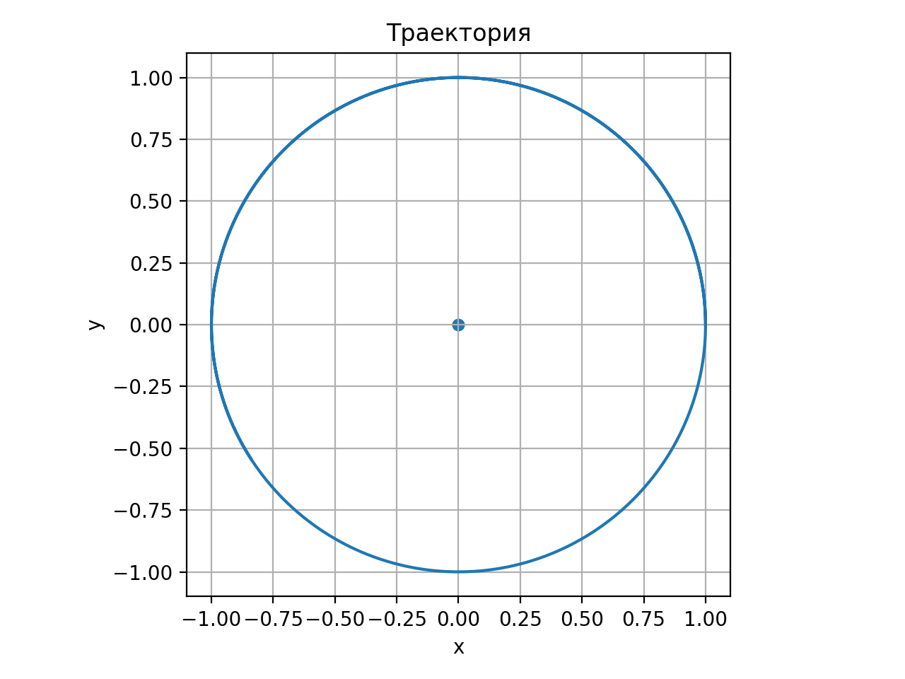
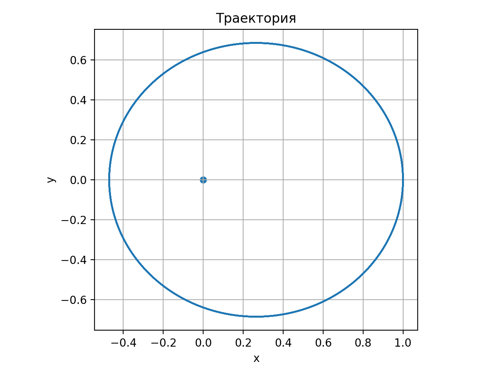
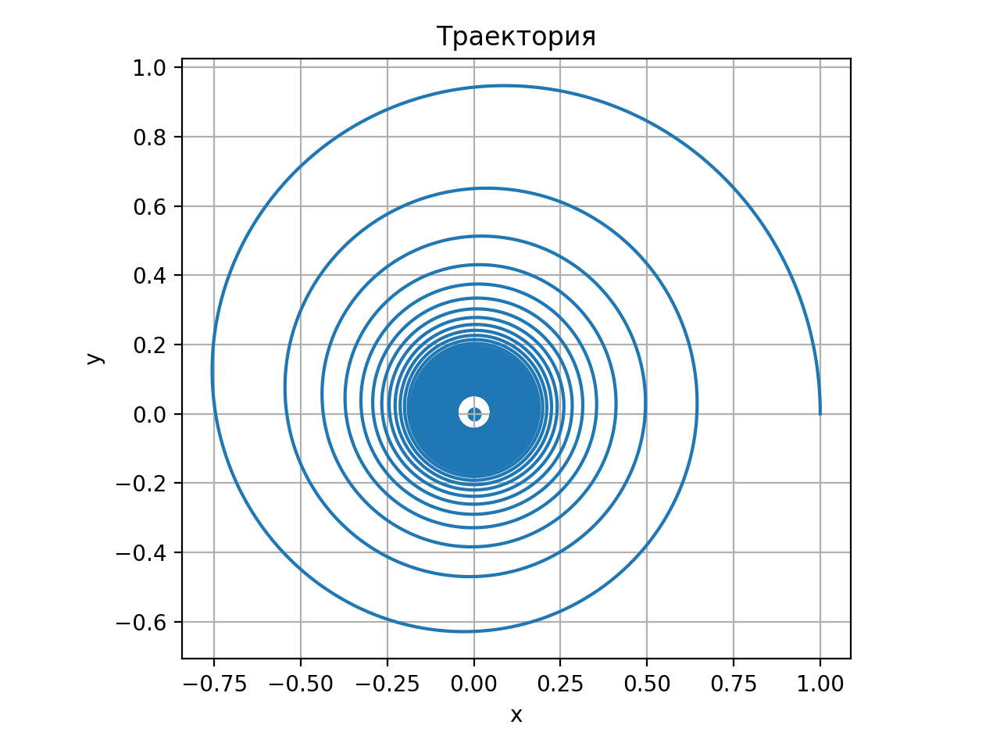

# Моделирование движения материальной точки в поле тяготения

## Описание проекта

Данный проект реализует численное моделирование движения материальной точки в центральном гравитационном поле в двумерном пространстве.
И представляет это моделирование в виде png и gif.

Модель учитывает:
- гравитационное притяжение к неподвижному центру;
- линейное сопротивление среды;
- тягу двигателя, направленную вдоль скорости.

Программа позволяет исследовать различные режимы движения:
- круговые и эллиптические орбиты,
- спиральное движение к центру (при наличии сопротивления),
- увеличение радиуса орбиты при включении тяги.

Решение системы дифференциальных уравнений выполняется численно методом Рунге–Кутты 4-го порядка.

---

## Математическая модель

Положение точки:

$$
r = \sqrt{x^2 + y^2}
$$  

Система уравнений движения:

$$
\dot{x} = v_x
$$

$$
\dot{y} = v_y
$$

$$
\dot{v_x} = -\mu \frac{x}{r^3} + (k_{thrust} - k_{drag})\,v_x
$$

$$
\dot{v_y} = -\mu \frac{y}{r^3} + (k_{thrust} - k_{drag})\,v_y
$$

где:

- $\mu = GM$ — гравитационный параметр,
- $k_{drag}$ — коэффициент сопротивления среды,
- $k_{thrust}$ — коэффициент тяги двигателя.

---

## Установка и запуск

### 1. Склонировать или скачать проект

Скачать файл `main.py` и `requirements.txt`.

---

### 2. Установить зависимости

В терминале выполнить:

```bash
python -m pip install -r requirements.txt
```

После установки зависимостей программа готова к использованию.

---


## Запуск программы

Чтобы запустить программу, напишите в терминале:

```bash
python main.py
````

Вы можете добавлять параметры командной строки, чтобы задавать начальные условия, физические коэффициенты и настройки численного метода.

Пример запуска с параметрами:

```bash
python main.py --vy0 0.8 --t_max 20 --save_png
```

---

## Список параметров

### 1) Начальные условия (положение и скорость)

| Параметр | Что задаёт                  | По умолчанию |
| -------- | --------------------------- | ------------ |
| `--x0`   | начальная координата `x(0)` | `1.0`        |
| `--y0`   | начальная координата `y(0)` | `0.0`        |
| `--vx0`  | начальная скорость `vx(0)`  | `0.0`        |
| `--vy0`  | начальная скорость `vy(0)`  | `1.0`        |

---

### 2) Физические параметры модели

| Параметр      | Что задаёт                                                                          | По умолчанию     |
| ------------- | ----------------------------------------------------------------------------------- | ---------------- |
| `--mu`        | гравитационный параметр `mu = GM`                                                   | `1.0`            |
| `--k_drag`    | коэффициент сопротивления среды (торможение)                                        | `0.0`            |
| `--k_thrust0` | тяга до переключения                                                                | `0.0`            |
| `--k_thrust1` | тяга после переключения                                                             | `0.0`            |
| `--r_switch`  | радиус переключения: при `r <= r_switch` тяга меняется с `k_thrust0` на `k_thrust1` | `-1` (выключено) |
| `--t_switch`  | время переключения: при `t >= t_switch` тяга меняется с `k_thrust0` на `k_thrust1`  | `-1` (выключено) |

---

### 3) Численные параметры (настройки расчёта)

| Параметр      | Что задаёт                                                 | По умолчанию |
| ------------- | ---------------------------------------------------------- | ------------ |
| `--dt`        | шаг интегрирования по времени                              | `0.002`      |
| `--t_max`     | общее время моделирования                                  | `30.0`       |
| `--r_stop`    | условие остановки: если `r <= r_stop`, расчёт прекращается | `0.03`       |
| `--max_steps` | максимальное число шагов (защита от бесконечного цикла)    | `2000000`    |

---

### 4) Параметры вывода (что сделать с результатом)

| Параметр     | Что делает                                                   |
| ------------ | ------------------------------------------------------------ |
| `--save_png` | сохраняет график траектории в файл `trajectory.png`          |
| `--save_gif` | сохраняет анимацию движения в файл `animation.gif`           |
| `--show`     | показывает график в окне (пока окно открыто — терминал ждёт) |
| `--fps`      | FPS для GIF-анимации (используется только с `--save_gif`)    |
| `--tail`     | длина “хвоста” траектории в кадрах (только для GIF)          |

---

### 5) Интерактивный ввод

| Параметр        | Что делает                                                 |
| --------------- | ---------------------------------------------------------- |
| `--interactive` | включает ввод `x0, y0, vx0, vy0` через `input()` в консоли |

---

## Быстрые примеры команд

Круговая орбита (контроль):

```bash
python main.py --mu 1 --x0 1 --y0 0 --vx0 0 --vy0 1 --t_max 10 --save_png
```


---

Эллипс:

```bash
python main.py --vy0 0.8 --t_max 20 --save_png
```


Спираль к центру (с сопротивлением):

```bash
python main.py --k_drag 0.05 --t_max 30 --r_stop 0.005 --dt 0.001 --save_png
```


